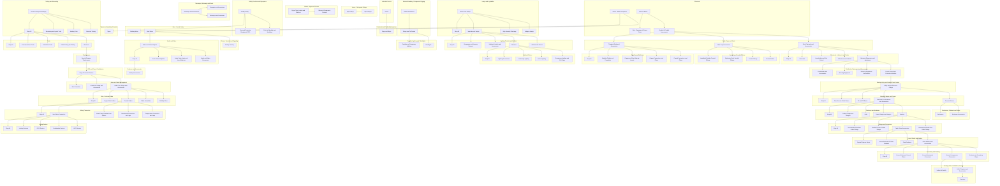

```mermaid
graph TD
  A[Electrical]
  B[Wire - Cord & Cable]
  C[Alarms, Security and Signaling]
  D[Audio and Video]
  E[Batteries and Accessories]
  F[Cable Trays and Struts]
  G[Chemicals, Lubricants and Paints]
  H[Conduit and Conduit Fittings]
  I[DataComm/TeleComm]
  J[Distribution Equipment and Accessories]
  K[Electric Utility and Outside Plant Product]
  L[Electrical Boxes and Covers]
  M[Enclosures, Cabinets and Racks]
  N[Fasteners and Hardware]
  O[Fittings and Connectors]
  P[Fuses, Blocks and Holders]
  Q[Grounding and Bonding]
  R[Heating, Fans, Ventilation, Vacuum]
  S[Hoses, Tubing and Fittings]
  T[Industrial Control]
  U[Janitorial and Facility Maintenance]
  V[Labels, Signs and Printers]
  W[Lamps and Lightbulbs]
  X[Lighting Controls and Ballasts]
  Y[Lighting Fixtures]
  Z[Material Handling, Storage and Rigging]
  AA[Portable Lighting and Flashlights]
  BB[Raceways, Wireways and Ducts]
  CC[Safety Products and Equipment]
  DD[Tapes and Insulating Products]
  EE[Testing and Measuring]
  FF[Tools]
  GG[Transformers]
  HH[UPS and Power Conditioning]
  II[Wire and Cable Management]
  JJ[Wire, Cord and Cable]
  KK[Wiring Connectors]
  LL[Wiring Devices]
```

```mermaid
graph TD
  subgraph Electrical
    a[Boxes - Bodies & Spacers]
    b[Junction Boxes]
    c[Conduit & Conduit Accessories]
    d[Strut - Raceways & Power Poles]
  end

  subgraph "Wire - Cord & Cable"
    e[Bare Wires]
    f[Building Wires]
  end

  subgraph "Alarms, Security and Signaling"
    g[Facility Security]
  end

  subgraph "Audio and Video"
    h[Audio and Video Adapters]
    i[Audio and Video Connectors]
    j[Audio Video Jacks and Insert Modules]
    k[Audio Video Wallplates]
    l[Shop All]
  end

  subgraph "Batteries and Accessories"
    m[Battery Accessories]
  end

  subgraph "Cable Trays and Struts"
    n[Strut Channels and Accessories]
    o[Cable Tray Accessories]
    p[Threaded Rods and Accessories]
  end

  subgraph "Chemicals, Lubricants and Paints"
    q[Adhesive Dispensers and Applicators]
    r[Adhesives and Sealants]
    s[Insecticides and Pest Control]
    t[Lubricants]
    u[Shop All]
  end

  subgraph "Conduit and Conduit Fittings"
    v[Conduit Bodies]
    w[Conduit Fittings]
    x[Explosion-Proof Conduit Fittings]
    y[Liquidtight Flexible Conduit Fittings]
  end

  subgraph "DataComm/TeleComm"
    z[Coaxial Connectors and Plugs]
    aa[Copper Connectors and Plugs]
    ab[Copper and Fiber Modular Inserts]
    ac[Modular Outlets and Faceplates]
    ad[Shop All]
  end

  subgraph "Distribution Equipment and Accessories"
    ae[Fused Overcurrent Protection Modules]
    af[Metering Equipment Accessories]
    ag[Metering Equipment]
    ah[Panelboards and Accessories]
  end

  subgraph "Electric Utility and Outside Plant Product"
    ai[Utility Service Entrance Fittings]
  end

  subgraph "Electrical Boxes and Covers"
    aj[Concrete Boxes]
    ak[Electrical Box Hardware and Accessories]
    al[FS and FD Boxes]
    am[Floor Service Outlet Boxes]
    an[Shop All]
  end

  subgraph "Enclosures, Cabinets and Racks"
    ao[Enclosure Accessories]
    ap[Enclosures]
  end

  subgraph "Fasteners and Hardware"
    aq[Anchors]
    ar[Beam Clamps and Hangers]
    as[Bolts]
    at[Ceiling Clamps and Hangers]
    au[Shop All]
  end

  subgraph "Fittings and Connectors"
    av[Armored and Metal Clad Cable Fittings]
    aw[Cable Gland Accessories]
    ax[Flexible Cord and Cable Fittings]
    ay[Non-Metallic Sheathed Cable Fittings]
    az[Shop All]
  end

  subgraph "Fuses, Blocks and Holders"
    ba[Fuse Holders and Accessories]
    bb[Fuse Reducers]
    bc[Fuses Electrical UL Class Standard]
    bd[Special Purpose Fuses]
  end

  subgraph "Grounding and Bonding"
    be[Busbars and Grounding Strips]
    bf[Ground Compression Connectors]
    bg[Ground Mechanical Connectors]
    bh[Ground Rods and Ground Plates]
    bi[Shop All]
  end

  subgraph "Heating, Fans, Ventilation, Vacuum"
    bj[HVAC Supplies and Accessories]
    bk[Indoor Air Quality]
    bl[Vacuums]
  end

  subgraph "Hoses, Tubing and Fittings"
    bm[Pipe Fittings]
    bn[Pipe Flanges]
  end

  subgraph "Industrial Control"
    bo[Timers]
  end

  subgraph "Janitorial and Facility Maintenance"
    bp[Rags and Wipes]
  end

  subgraph "Labels, Signs and Printers"
    bq[Signs, Tags, Labels and Markers]
    br[Wire and Component Markers]
  end

  subgraph "Lamps and Lightbulbs"
    bs[Fluorescent Lamps]
    bt[Halogen Lamps]
    bu[High Intensity Discharge]
    bv[Incandescent Lamps]
    bw[Shop All]
  end

  subgraph "Lighting Controls and Ballasts"
    bx[Ballasts and Drivers]
    by[Dimmers]
    bz[Lighting Controls and Accessories]
    ca[Occupancy and Vacancy Sensors]
    cb[Shop All]
  end

  subgraph "Lighting Fixtures"
    cc[Emergency Lighting and Exit Signs]
    cd[Indoor Lighting]
    ce[Landscape Lighting]
    cf[Lighting Accessories]
    cg[Shop All]
  end

  subgraph "Material Handling, Storage and Rigging"
    ch[Dollies and Movers]
    ci[Straps and Tie Downs]
  end

  subgraph "Portable Lighting and Flashlights"
    cj[Flashlights]
    ck[Portable and Temporary Lighting]
  end

  subgraph "Raceways, Wireways and Ducts"
    cl[Raceways and Accessories]
    cm[Runways and Accessories]
    cn[Wireways and Accessories]
  end

  subgraph "Safety Products and Equipment"
    co[Facility Safety]
    cp[First Aid, Medical and Hydration]
    cq[Personal Protective Equipment -PPE-]
  end

  subgraph "Tapes and Insulating Products"
    cr[Tapes]
  end

  subgraph "Testing and Measuring"
    cs[Circuit Tracing and Verifying]
    ct[Electrical Testing]
    cu[Marking Tools]
    cv[Measuring and Layout Tools]
    cw[Shop All]
  end

  subgraph "Tools"
    cx[Abrasives]
    cy[Cable Fishing and Pulling]
    cz[Cable/Wire Tools]
    da[Communications Tools]
    db[Shop All]
  end

  subgraph "Transformers"
    dc[Special Purpose Transformers]
  end

  subgraph "UPS and Power Conditioning"
    dd[Surge Protective Devices]
  end

  subgraph "Wire and Cable Management"
    de[Cable Ties, Straps and Accessories]
    df[Shrink-On Tubing and Accessories]
    dg[Wire Protection]
  end

  subgraph "Wire, Cord and Cable"
    dh[Building Wires]
    di[Cable Assemblies]
    dj[Coaxial Cables]
    dk[Copper Data Cables]
    dl[Shop All]
  end

  subgraph "Wiring Connectors"
    dm[Compression Connectors and Lugs]
    dn[Mechanical Connectors and Lugs]
    do[Small Crimp Terminals and Splices]
    dp[Small Wire Connectors]
    dq[Shop All]
  end

  subgraph "Wiring Devices"
    dr[AFCI Devices]
    ds[Combination Devices]
    dt[GFCI Devices]
    du[Locking Devices]
    dv[Shop All]
  end

  a --> e
  a --> f
  b --> c
  b --> d
  e --> g
  e --> h
  h --> i
  h --> j
  h --> k
  h --> l
  l --> m
  c --> n
  c --> o
  c --> p
  n --> q
  n --> r
  n --> s
  n --> t
  n --> u
  o --> v
  o --> w
  o --> x
  o --> y
  p --> z
  p --> aa
  p --> ab
  p --> ac
  p --> ad
  q --> ae
  q --> af
  q --> ag
  q --> ah
  ae --> ai
  ai --> aj
  ai --> ak
  ai --> al
  ai --> am
  ai --> an
  aj --> ao
  aj --> ap
  ak --> aq
  ak --> ar
  ak --> as
  ak --> at
  ak --> au
  aq --> av
  aq --> aw
  aq --> ax
  aq --> ay
  aq --> az
  aw --> ba
  aw --> bb
  aw --> bc
  aw --> bd
  ba --> be
  ba --> bf
  ba --> bg
  ba --> bh
  ba --> bi
  bf --> bj
  bf --> bk
  bj --> bl
  bm --> bn
  bo --> bp
  bq --> br
  bs --> bt
  bs --> bu
  bs --> bv
  bs --> bw
  bv --> bx
  bv --> by
  bv --> bz
  bv --> ca
  bv --> cb
  by --> cc
  by --> cd
  by --> ce
  by --> cf
  by --> cg
  ch --> ci
  ci --> cj
  ci --> ck
  cl --> cm
  cl --> cn
  co --> cp
  co --> cq
  co --> cr
  cs --> ct
  cs --> cu
  cs --> cv
  cs --> cw
  cw --> cx
  cw --> cy
  cw --> cz
  cw --> da
  cw --> db
  cx --> dc
  dc --> dd
  dd --> de
  dd --> df
  dd --> dg
  de --> dh
  de --> di
  de --> dj
  de --> dk
  de --> dl
  dj --> dm
  dj --> dn
  dj --> do
  dj --> dp
  dj --> dq
  dp --> dr
  dp --> ds
  dp --> dt
  dp --> du
  dp --> dv
```